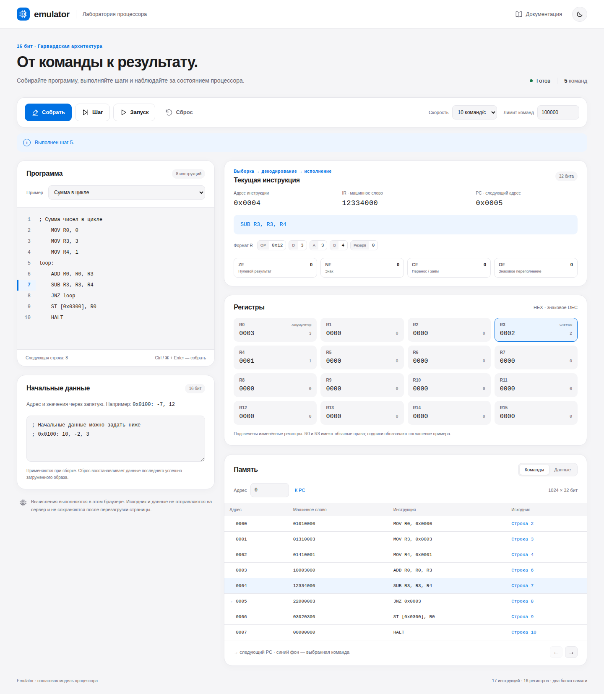
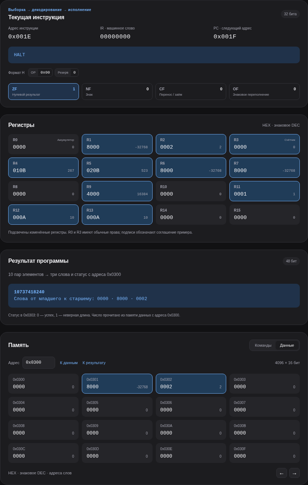

<div align="center">
  <a href="https://minkinad.github.io/emulator/app/">
    
  </a>
  <h1>Emulator</h1>
  <p><strong>Браузерный эмулятор процессора: ассемблер, пошаговое исполнение и наглядное состояние регистров, памяти и флагов.</strong></p>

[](https://github.com/minkinad/emulator/actions/workflows/core.yml)
[](https://github.com/minkinad/emulator/actions/workflows/docs.yml)
[](https://github.com/minkinad/emulator/actions/workflows/pages.yml)
[](https://github.com/minkinad/emulator/blob/main/package.json)
[](https://github.com/minkinad/emulator/blob/main/package.json)

[Возможности](#возможности) · [Скриншоты](#скриншоты) · [Быстрый старт](#быстрый-старт) · [Модель процессора](#модель-процессора) · [Документация](#документация)

</div>

---

Эмулятор 16-битного процессора с гарвардской архитектурой и трёхадресными арифметическими командами. Позволяет собрать ассемблерную программу в машинные слова, выполнить её по шагам и получить состояние регистров, памяти и флагов.

[Открыть эмулятор](https://minkinad.github.io/emulator/app/) · [Документация](https://minkinad.github.io/emulator/) · [PDF отчёта](https://minkinad.github.io/emulator/reports/emulator-report.pdf) · [Сценарии демонстрации](docs/report/demonstration.md)

## Возможности

- Редактор ассемблера с метками, диагностикой и переходом к ошибочной строке.
- Сборка в машинные слова, пошаговое выполнение, запуск, пауза, лимит команд и сброс.
- Все 16 регистров, флаги, PC и IR; текущая инструкция как машинное слово, ассемблер и поля.
- Раздельная память команд и данных, начальные значения, подсветка изменений и связь с исходником.
- Готовые примеры: цикл, работа с памятью, перенос между словами, сумма массива и 48-битная свёртка.
- Светлая и тёмная темы, управление с клавиатуры и адаптивная вёрстка в стиле SwiftUI.

Ядро и ассемблер доступны также как независимые TypeScript-модули и через консольные примеры. Вычисления выполняются в браузере; пользовательский исходник и данные не отправляются на сервер.

## Скриншоты

Рабочая область после пятой команды: редактор слева, декодированная инструкция, флаги, регистры и память справа.



<details>
<summary>Тёмная тема и результат длинной арифметики</summary>

Свёртка двух массивов по десять значений −32768: результат **10737418240**, слова памяти `0000 8000 0002`. Число не помещается в 32 бита, поэтому используется 48-битный аккумулятор.



</details>

<a id="быстрый-старт"></a>

## Быстрый старт

Требуются Node.js 22.12+ и npm. Из корня репозитория:

```bash
npm ci
npm run dev
```

Откройте адрес Vite с путём `/emulator/app/`. Пример «Сумма в цикле» вычисляет `3 + 2 + 1 = 6`. Результат сохраняется в памяти данных по адресу `0x0300`.

В редакторе нажмите **Собрать** (`Ctrl+Enter` / `⌘+Enter`), затем **Шаг** или **Запуск**. После изменения программы или данных требуется новая сборка. **Сброс** возвращает последний успешно загруженный образ.

Для консольной сборки с машинным листингом: `npm run assembler:demo`. Для демонстрации ручных машинных слов: `npm run core:demo`.

## Примеры для первого запуска

| Пример | Что показывает | Результат |
| --- | --- | --- |
| Сумма в цикле | Метка, условный переход и запись в память. | `6`, 14 команд. |
| Работа с памятью | Загрузка двух знаковых значений и сохранение суммы. | `5`, 5 команд. |
| Перенос между словами | `ADD` и `ADC` для числа шире одного регистра. | `0000 0001`, 9 команд. |
| Сумма массива · 32 бита | Цикл и расширение знака десяти элементов. | `−5`, 81 команда. |
| Свёртка массивов · 48 бит | Знаковое умножение и перенос между тремя словами. | `10737418240`, 139 команд. |

Слова указаны от младшего к старшему; результат начинается с адреса данных `0x0300`. Подробные наборы и границы — в [описании программ](docs/architecture/programs.md).

## Написать программу

```asm
    MOV R0, 0
    MOV R1, 3
    MOV R2, 1
loop:
    ADD R0, R0, R1
    SUB R1, R1, R2
    JNZ loop
    ST [0x0300], R0
    HALT
```

После `npm run build` модули доступны из ESM-скрипта в корне проекта:

```js
import { assemble } from './dist/assembler/index.js';
import { Cpu, run } from './dist/core/index.js';

const assembled = assemble('MOV R0, 5\nHALT');
const cpu = new Cpu(assembled.image);
const result = run(cpu, 1000);
console.log(result.state.registers[0]); // 5
```

Ассемблер возвращает образ программы, таблицу меток и карту исходных строк. CPU исполняет машинные слова из отдельной памяти команд. Данные передаются в образе отдельно от текста программы.

## Модель процессора

| Компонент | Параметры |
| --- | --- |
| Регистры | 16 регистров по 16 бит, `PC`, 32-битный `IR`. |
| Команды | 17 операций, фиксированная длина 32 бита. |
| Память команд | 1024 инструкции; адрес следующей команды увеличивается на 1. |
| Память данных | 4096 слов по 16 бит, отдельное адресное пространство. |
| Арифметика | Знаковые целые в дополнительном коде; `ZF`, `NF`, `CF`, `OF`. |
| Адресация | Непосредственная, регистровая, прямая и косвенно-регистровая. |
| Управление | Один шаг, ограниченный запуск, остановка, диагностика и сброс. |

Доступны программы 32-битной суммы массива и 48-битного скалярного произведения десяти пар. Длинные числа обрабатываются последовательностью команд с переносом. Выберите программу в браузере или выполните `npm run arrays:demo`: результаты по умолчанию — `−5` и `10737418240`.

## Что важно знать

- Команды и данные имеют разные адресные пространства; одинаковый адрес не обозначает одну ячейку.
- Лимит ограничивает один запуск. После его достижения выполнение можно продолжить; в быстром режиме экран обновляется порциями до 250 команд.
- Первое слово массива — длина, а не слагаемое. Сумма предполагает длину 0…15; свёртка проверяет обе длины на равенство 10.
- Стек, прерывания, директивы ассемблера и автоматическое сохранение программ не реализованы. При перезагрузке исходник и данные сбрасываются; сохраняется только тема.

## Проверка проекта

```bash
npm run check
npm run arrays:demo
npx playwright install chromium
npm run test:browser
```

`check` проверяет типы, модульные и интеграционные тесты, листинги отчёта и сборки. Браузерные сценарии запускаются отдельно и используют уже собранное приложение. Математические результаты сверяются с независимым bigint-эталоном, включая граничные значения, промежуточные суммы и переносы. Бейджи выше показывают состояние workflow на GitHub для `main`.

## Документация

- [Работа с браузерным эмулятором](docs/project/application.md).
- [Синтаксис и API ассемблера](docs/architecture/assembler.md).
- [Спецификация процессора](docs/architecture/cpu.md) и [API ядра](docs/architecture/core-api.md).
- [Алгоритмы обработки массивов](docs/architecture/programs.md).
- [Отчёт о реализации](docs/report/report.md) и [протокол демонстрации](docs/report/demonstration.md).
- [Сравнение 16 вариантов архитектуры](docs/reference/variants.md).
- [Структура проекта](docs/project/structure.md), [участие в разработке](.github/CONTRIBUTING.md) и [план развития](docs/project/implementation.md).
- [Публикация документации](docs/project/publishing.md) и [история изменений](CHANGELOG.md).

## Команды проекта

| Команда | Назначение |
| --- | --- |
| `npm run dev` | Разработка приложения по пути `/emulator/app/`. |
| `npm run app:build` | Проверка типов UI и сборка приложения в `dist/app/`. |
| `npm run preview` | Просмотр собранного приложения. |
| `npm run test:browser` | Проверки приложения в Chromium (после `app:build` и `npx playwright install chromium`). |
| `npm run report:check` | Сверка четырёх листингов отчёта с исходными файлами. |
| `npm run report:pdf` | Сборка документации и PDF без титульного листа; требуется Chromium Playwright. |
| `npm run site:build` | Сборка документации и приложения в единый артефакт Pages. |
| `npm run assembler:demo` | Сборка и исполнение ассемблерного примера с циклом. |
| `npm run arrays:demo` | Машинные листинги и проверенный запуск обеих программ массивов. |
| `npm run programs:prepare` | Обновление модуля исходников после изменения `.asm` программ массивов. |
| `npm run core:demo` | Исполнение четырёх вручную закодированных инструкций. |
| `npm run typecheck` | Строгая проверка типов исходников и тестов. |
| `npm test` | Тесты всех модулей; перед компиляцией удаляются старые результаты тестовой сборки. |
| `npm run build` | Сборка TypeScript-модулей в `dist/`. |
| `npm run docs:dev` | Локальная разработка документации по пути `/emulator/`. |
| `npm run docs:build` | Сборка только документации. |
| `npm run docs:preview` | Просмотр собранного сайта. |
| `npm run check` | Проверка типов, тесты, сборка модулей и полного сайта. Браузерные проверки запускаются отдельно. |

## Структура репозитория

```text
src/core/              Модель процессора, кодек, АЛУ и память
src/assembler/         Разбор исходников, метки и диагностика
src/programs/          Каталог программ массивов и интерпретация результатов
src/ui/                React-компоненты и модель сеанса исполнения
tests/                 Модульные и браузерные проверки
examples/              Машинные и ассемблерные примеры
docs/architecture/     Спецификация, API и алгоритмы
docs/project/          Структура, развитие и публикация
docs/reference/        Справочные материалы
docs/report/           Технический отчёт и протокол демонстрации
website/               Тема и исходники сайта документации
scripts/               Подготовка документации и запуск тестов
task/                  Исходная методичка
.github/               CI, публикация и шаблоны задач
```

Ядро и ассемблер написаны на TypeScript и не зависят от React, DOM или Node.js. Консольные примеры используют Node.js; документация — VitePress. Браузерное приложение использует React + Vite.

## Участие в разработке

Порядок изменений и подходящие проверки описаны в [CONTRIBUTING](.github/CONTRIBUTING.md). Для [сообщения об ошибке](https://github.com/minkinad/emulator/issues/new?template=bug_report.md) укажите программу, начальные данные и ожидаемое состояние. Для [предложения](https://github.com/minkinad/emulator/issues/new?template=task.md) опишите результат и критерии готовности. История выполненных изменений — в [CHANGELOG](CHANGELOG.md).
